Analysis on Shakespeare
================
Shihua Lu
2022-03-14

For HW09, I am doing a sentiment analysis for Shakespeare’s works. I
have chosen three tragedies: Macbeth, Romeo and Juliet, Hamlet and three
comedies: Midnight Summer’s Dream, As you Like it, The Merchant of
Venice. The goal of this project is to see whether the results of my
sentiment analysis can show if a play is a tragedy or comedy. The
definition of what a tragedy is is always under debate in the field of
Art, film studies, Aesthetics and philosophy. Sometimes I get a little
bored, just for reading too much theoretical content. Let’s see if the
debate can be solved by data analysis.

# load data

``` r
# Tragedies
romeo <- read.delim("The Tragedy of Romeo and Juliet.txt")
macbeth <- read.delim("Macbeth")
hamlet <- read.delim("Hamlet")
# Comedies
asyoulikeit <- read.delim("As You Like It")
midnight <- read.delim("midnight summer")
venice <- read.delim("The Merchant of Venice ")
```

# create corpus

``` r
preprocessing = function (doc){
   doc = gsub("[^[:alnum:]]"," ",doc)
   #create corpus
   corpus = Corpus(VectorSource(doc))
   #Removal of punctuation
   corpus = tm_map(corpus, removePunctuation)
   #Removal of numbers
   corpus = tm_map(corpus, removeNumbers)
   #Conversion to lower case
   corpus = tm_map(corpus, content_transformer(tolower)) 
   #customize my stopwords
   mystopword = data("stop_words")
   #Removal of stopwords
   corpus = tm_map(corpus, removeWords, c(stopwords("english"),mystopword))
   return(corpus)
}
romeo.cleaned = preprocessing(romeo)
macbeth.cleaned = preprocessing(macbeth)
hamlet.cleaned = preprocessing(hamlet)
asyoulikeit.cleaned = preprocessing(asyoulikeit)
midnight.cleaned = preprocessing(midnight)
venice.cleaned = preprocessing(venice)
```

# Data Visualization: word cloud

``` r
par(mfrow=c(2,3)) 
par(mar=c(2, 3, 2, 3)) # Set the plot margin
par(bg="black") # set background color as black
par(col.main="white") # set title color as white
wordcloud(romeo.cleaned, scale=c(4,.5),min.freq=3, max.words=Inf, random.order=F, 
           colors = brewer.pal(8, "Set3"))   
title("Romeo and Juliet")
wordcloud(macbeth.cleaned, scale=c(4,.5),min.freq=3, max.words=Inf, random.order=F, 
           colors = brewer.pal(8, "Set3"))   
title("Macbeth")
wordcloud(hamlet.cleaned, scale=c(4,.5),min.freq=3, max.words=Inf, random.order=F, 
           colors = brewer.pal(8, "Set3"))   
title("Hamlet")
wordcloud(asyoulikeit.cleaned, scale=c(4,.5),min.freq=3, max.words=Inf, random.order=F, 
           colors = brewer.pal(8, "Set3"))   
title("As You Like It")
wordcloud(midnight.cleaned, scale=c(4,.5),min.freq=3, max.words=Inf, random.order=F, 
           colors = brewer.pal(8, "Set3"))   
title("Midnight Summer's Dream")
wordcloud(venice.cleaned, scale=c(4,.5),min.freq=3, max.words=Inf, random.order=F, 
           colors = brewer.pal(8, "Set3"))   
title("The Merchant of Venice")
```

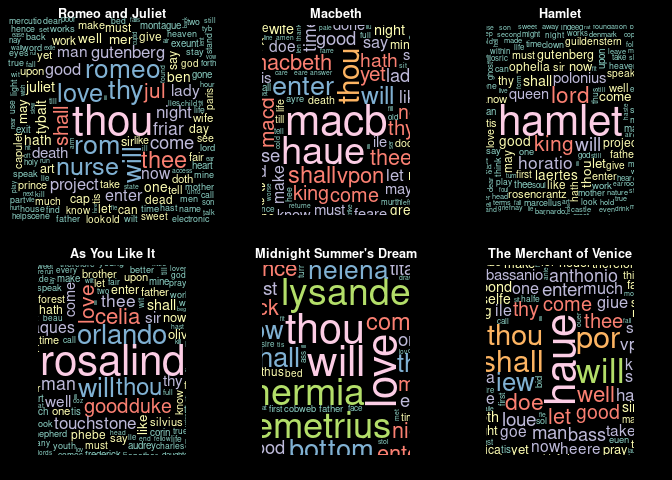<!-- --> # Data
Visualization: Word Frequency

``` r
romeo.dtm = DocumentTermMatrix(romeo.cleaned)
 findFreqTerms(romeo.dtm, 5)
```

    ##   [1] "abr"          "access"       "act"          "age"          "agree"       
    ##   [6] "agreement"    "air"          "alack"        "alas"         "alone"       
    ##  [11] "already"      "among"        "ancient"      "anger"        "anon"        
    ##  [16] "another"      "answer"       "anything"     "apothecary"   "archive"     
    ##  [21] "arm"          "art"          "aside"        "ask"          "asleep"      
    ##  [26] "associated"   "away"         "awhile"       "back"         "bad"         
    ##  [31] "bal"          "balthasar"    "banish"       "banished"     "banishment"  
    ##  [36] "bear"         "beat"         "beauty"       "bed"          "behold"      
    ##  [41] "ben"          "benvolio"     "beseech"      "best"         "better"      
    ##  [46] "bid"          "bite"         "black"        "blessed"      "blind"       
    ##  [51] "blood"        "bloody"       "body"         "bones"        "book"        
    ##  [56] "bosom"        "bound"        "bow"          "boy"          "break"       
    ##  [61] "breast"       "breath"       "bride"        "brief"        "bright"      
    ##  [66] "bring"        "brother"      "brow"         "business"     "call"        
    ##  [71] "calls"        "came"         "can"          "canst"        "cap"         
    ##  [76] "capulet"      "capulets"     "care"         "case"         "cause"       
    ##  [81] "cell"         "chamber"      "change"       "charge"       "cheek"       
    ##  [86] "cheeks"       "chide"        "chief"        "child"        "church"      
    ##  [91] "churchyard"   "citizens"     "city"         "close"        "clouds"      
    ##  [96] "cold"         "come"         "comes"        "comfort"      "commend"     
    ## [101] "company"      "compliance"   "comply"       "consent"      "copies"      
    ## [106] "copy"         "copyright"    "cords"        "corse"        "counsel"     
    ## [111] "count"        "county"       "course"       "cousin"       "crow"        
    ## [116] "cupid"        "cut"          "dagger"       "dance"        "dare"        
    ## [121] "dark"         "date"         "daughter"     "day"          "days"        
    ## [126] "dead"         "dear"         "death"        "deep"         "den"         
    ## [131] "desperate"    "dew"          "didst"        "die"          "distribute"  
    ## [136] "distributing" "distribution" "dog"          "domain"       "donations"   
    ## [141] "done"         "doom"         "dost"         "doth"         "draw"        
    ## [146] "draws"        "dream"        "dreams"       "dry"          "ear"         
    ## [151] "early"        "ears"         "earth"        "ease"         "ebook"       
    ## [156] "ebooks"       "either"       "electronic"   "else"         "end"         
    ## [161] "enemy"        "enough"       "enter"        "envious"      "ere"         
    ## [166] "even"         "ever"         "every"        "excuse"       "exeunt"      
    ## [171] "exile"        "exit"         "eye"          "eyes"         "face"        
    ## [176] "fain"         "fair"         "faith"        "fall"         "falls"       
    ## [181] "far"          "farewell"     "father"       "fear"         "fearful"     
    ## [186] "feast"        "fee"          "feel"         "fees"         "fellow"      
    ## [191] "fetch"        "fie"          "fight"        "find"         "fine"        
    ## [196] "fingers"      "fire"         "first"        "five"         "flesh"       
    ## [201] "flower"       "flowers"      "foe"          "follow"       "fool"        
    ## [206] "foot"         "forget"       "form"         "forth"        "fortune"     
    ## [211] "found"        "foundation"   "fourteen"     "free"         "friar"       
    ## [216] "friend"       "full"         "gave"         "general"      "gentle"      
    ## [221] "gentleman"    "gentlemen"    "get"          "girl"         "give"        
    ## [226] "gives"        "god"          "gold"         "gone"         "good"        
    ## [231] "goose"        "grace"        "grave"        "great"        "green"       
    ## [236] "greg"         "gregory"      "grief"        "ground"       "gutenberg"   
    ## [241] "hadst"        "half"         "hand"         "hands"        "hang"        
    ## [246] "happy"        "hare"         "hast"         "haste"        "hate"        
    ## [251] "hath"         "head"         "heads"        "hear"         "heart"       
    ## [256] "heaven"       "heavy"        "heir"         "hell"         "help"        
    ## [261] "hence"        "hide"         "hie"          "high"         "hit"         
    ## [266] "hither"       "hold"         "holder"       "holy"         "home"        
    ## [271] "honest"       "honour"       "honourable"   "hope"         "hot"         
    ## [276] "hour"         "hours"        "house"        "houses"       "http"        
    ## [281] "hurt"         "husband"      "iii"          "ill"          "including"   
    ## [286] "indeed"       "information"  "iron"         "jest"         "john"        
    ## [291] "joy"          "joyful"       "jul"          "juliet"       "keep"        
    ## [296] "kill"         "kind"         "kinsman"      "kiss"         "kisses"      
    ## [301] "knock"        "know"         "knowest"      "ladies"       "lady"        
    ## [306] "laid"         "lamentable"   "lark"         "last"         "late"        
    ## [311] "laurence"     "law"          "laws"         "lay"          "lead"        
    ## [316] "leave"        "less"         "let"          "letter"       "letters"     
    ## [321] "license"      "lie"          "lies"         "life"         "light"       
    ## [326] "like"         "limited"      "lips"         "literary"     "little"      
    ## [331] "live"         "lives"        "living"       "long"         "longer"      
    ## [336] "look"         "looks"        "lord"         "lov"          "love"        
    ## [341] "lovers"       "loving"       "mad"          "madam"        "made"        
    ## [346] "maid"         "maids"        "make"         "makes"        "man"         
    ## [351] "mantua"       "many"         "mark"         "marriage"     "married"     
    ## [356] "marry"        "maskers"      "master"       "match"        "matter"      
    ## [361] "may"          "mean"         "means"        "measure"      "medium"      
    ## [366] "meet"         "men"          "mer"          "mercutio"     "mercy"       
    ## [371] "merry"        "met"          "might"        "mind"         "mine"        
    ## [376] "mistress"     "mon"          "montague"     "montagues"    "monument"    
    ## [381] "morning"      "morrow"       "mother"       "move"         "moved"       
    ## [386] "much"         "murther"      "mus"          "music"        "musicians"   
    ## [391] "must"         "name"         "nature"       "nay"          "near"        
    ## [396] "need"         "never"        "new"          "news"         "next"        
    ## [401] "night"        "nine"         "noble"        "noise"        "none"        
    ## [406] "nothing"      "now"          "number"       "nurse"        "old"         
    ## [411] "one"          "open"         "orchard"      "org"          "others"      
    ## [416] "owner"        "page"         "paid"         "pale"         "par"         
    ## [421] "paragraph"    "pardon"       "paris"        "part"         "past"        
    ## [426] "patience"     "pay"          "peace"        "permission"   "person"      
    ## [431] "pet"          "peter"        "pglaf"        "phrase"       "piteous"     
    ## [436] "place"        "play"         "please"       "pleasure"     "point"       
    ## [441] "poison"       "poor"         "posted"       "power"        "pray"        
    ## [446] "prepare"      "pretty"       "prince"       "project"      "proud"       
    ## [451] "prove"        "provide"      "provided"     "public"       "purpose"     
    ## [456] "put"          "quarrel"      "quickly"      "quoth"        "read"        
    ## [461] "ready"        "reason"       "received"     "red"          "refund"      
    ## [466] "remember"     "remove"       "replacement"  "rest"         "return"      
    ## [471] "rich"         "right"        "ring"         "rom"          "romeo"       
    ## [476] "rosaline"     "rough"        "rude"         "run"          "sad"         
    ## [481] "said"         "saint"        "samp"         "satisfied"    "saw"         
    ## [486] "say"          "says"         "scene"        "scorn"        "sea"         
    ## [491] "search"       "second"       "section"      "see"          "seen"        
    ## [496] "send"         "serv"         "servant"      "serve"        "servingman"  
    ## [501] "set"          "shall"        "shalt"        "shame"        "shape"       
    ## [506] "short"        "show"         "shows"        "shrift"       "shut"        
    ## [511] "sick"         "side"         "sighs"        "sight"        "silver"      
    ## [516] "simple"       "sin"          "since"        "sir"          "sirrah"      
    ## [521] "sit"          "slain"        "sleep"        "slew"         "slow"        
    ## [526] "small"        "soft"         "son"          "soon"         "sorrow"      
    ## [531] "soul"         "sound"        "speak"        "speaks"       "spoke"       
    ## [536] "stand"        "stars"        "state"        "states"       "stay"        
    ## [541] "still"        "stir"         "stop"         "straight"     "strange"     
    ## [546] "street"       "strength"     "strike"       "sudden"       "sun"         
    ## [551] "swear"        "sweet"        "sword"        "swords"       "take"        
    ## [556] "tale"         "talk"         "tax"          "tear"         "tears"       
    ## [561] "tell"         "tender"       "terms"        "thank"        "thee"        
    ## [566] "therefore"    "thine"        "thing"        "things"       "think"       
    ## [571] "thou"         "though"       "thought"      "thousand"     "three"       
    ## [576] "thumb"        "thursday"     "thus"         "thy"          "thyself"     
    ## [581] "till"         "time"         "times"        "tis"          "tomb"        
    ## [586] "tongue"       "took"         "torch"        "trademark"    "tree"        
    ## [591] "true"         "trust"        "truth"        "turn"         "twenty"      
    ## [596] "two"          "tyb"          "tybalt"       "united"       "unless"      
    ## [601] "untimely"     "unto"         "upon"         "use"          "vault"       
    ## [606] "verona"       "vile"         "villain"      "voice"        "volunteers"  
    ## [611] "wake"         "waking"       "wall"         "warrant"      "wash"        
    ## [616] "wast"         "watch"        "way"          "web"          "wedding"     
    ## [621] "weep"         "welcome"      "well"         "wench"        "wherefore"   
    ## [626] "whose"        "wife"         "wild"         "will"         "wilt"        
    ## [631] "window"       "wings"        "wise"         "wisely"       "wish"        
    ## [636] "wit"          "withal"       "within"       "without"      "wits"        
    ## [641] "woe"          "woes"         "woful"        "woo"          "word"        
    ## [646] "words"        "work"         "works"        "world"        "writ"        
    ## [651] "written"      "www"          "years"        "yet"          "yond"        
    ## [656] "yonder"       "young"        "youth"

``` r
macbeth.dtm = DocumentTermMatrix(macbeth.cleaned)
 findFreqTerms(macbeth.dtm, 5)
```

    ##   [1] "actus"      "againe"     "alarum"     "almost"     "amen"      
    ##   [6] "angus"      "anon"       "another"    "answer"     "art"       
    ##  [11] "attend"     "attendants" "away"       "ayre"       "backe"     
    ##  [16] "bad"        "ban"        "banq"       "banquo"     "beare"     
    ##  [21] "bed"        "beene"      "bell"       "bene"       "best"      
    ##  [26] "better"     "bid"        "blood"      "bloody"     "bold"      
    ##  [31] "borne"      "braine"     "breath"     "bring"      "businesse" 
    ##  [36] "call"       "came"       "can"        "care"       "cauldron"  
    ##  [41] "cause"      "cawdor"     "certaine"   "chamber"    "chance"    
    ##  [46] "charme"     "children"   "cold"       "colours"    "come"      
    ##  [51] "comes"      "comfort"    "command"    "comming"    "country"   
    ##  [56] "crowne"     "cry"        "daggers"    "dare"       "darke"     
    ##  [61] "day"        "dayes"      "dead"       "death"      "deed"      
    ##  [66] "deepe"      "desire"     "doct"       "doctor"     "doe"       
    ##  [71] "donalbaine" "done"       "doth"       "double"     "downe"     
    ##  [76] "drinke"     "duncan"     "dunsinane"  "duties"     "eare"      
    ##  [81] "earth"      "else"       "england"    "english"    "enough"    
    ##  [86] "enter"      "ere"        "euen"       "euer"       "euery"     
    ##  [91] "exeunt"     "exit"       "eye"        "eyes"       "face"      
    ##  [96] "faces"      "faire"      "faith"      "fall"       "false"     
    ## [101] "farre"      "fate"       "father"     "feare"      "feares"    
    ## [106] "feast"      "fell"       "fight"      "fill"       "finde"     
    ## [111] "fire"       "first"      "fleans"     "fled"       "flourish"  
    ## [116] "flye"       "former"     "forth"      "fortune"    "foule"     
    ## [121] "free"       "friend"     "friends"    "full"       "gent"      
    ## [126] "gentle"     "get"        "giue"       "giuen"      "god"       
    ## [131] "goe"        "goes"       "gone"       "good"       "grace"     
    ## [136] "gracious"   "graue"      "great"      "haile"      "hand"      
    ## [141] "hands"      "hang"       "harme"      "hast"       "hath"      
    ## [146] "haue"       "head"       "health"     "heard"      "heare"     
    ## [151] "hearke"     "heart"      "heauen"     "hee"        "heere"     
    ## [156] "hell"       "helpe"      "hence"      "high"       "highnesse" 
    ## [161] "himselfe"   "hither"     "hold"       "home"       "honest"    
    ## [166] "honor"      "hope"       "horror"     "horses"     "hostesse"  
    ## [171] "houre"      "house"      "husband"    "ile"        "indeed"    
    ## [176] "innocent"   "issue"      "keepe"      "kill"       "king"      
    ## [181] "kings"      "knock"      "knocking"   "know"       "knowes"    
    ## [186] "knowne"     "lady"       "last"       "late"       "lay"       
    ## [191] "leaue"      "left"       "len"        "lenox"      "lesse"     
    ## [196] "let"        "life"       "light"      "like"       "little"    
    ## [201] "liue"       "liues"      "looke"      "lord"       "lords"     
    ## [206] "lost"       "loue"       "lye"        "lyes"       "mac"       
    ## [211] "macb"       "macbeth"    "macd"       "macduff"    "macduffe"  
    ## [216] "made"       "make"       "makes"      "mal"        "malc"      
    ## [221] "malcolme"   "man"        "many"       "master"     "may"       
    ## [226] "meanes"     "meet"       "meeting"    "men"        "ment"      
    ## [231] "messenger"  "might"      "minde"      "mine"       "morrow"    
    ## [236] "mortall"    "mother"     "much"       "mur"        "murth"     
    ## [241] "murther"    "must"       "name"       "nature"     "natures"   
    ## [246] "neere"      "neuer"      "new"        "night"      "nights"    
    ## [251] "noble"      "none"       "nothing"    "now"        "old"       
    ## [256] "one"        "onely"      "ouer"       "owne"       "pale"      
    ## [261] "part"       "peace"      "perfect"    "place"      "please"    
    ## [266] "pleasure"   "point"      "poore"      "porter"     "power"     
    ## [271] "powre"      "pray"       "present"    "prima"      "purpose"   
    ## [276] "put"        "rather"     "reason"     "receiue"    "report"    
    ## [281] "rest"       "returne"    "ring"       "rise"       "rosse"     
    ## [286] "round"      "royall"     "safe"       "said"       "saw"       
    ## [291] "say"        "scena"      "scotland"   "secunda"    "see"       
    ## [296] "seeme"      "seemes"     "seene"      "selfe"      "selues"    
    ## [301] "send"       "seruant"    "set"        "sey"        "seyton"    
    ## [306] "seyward"    "shake"      "shall"      "shalt"      "shew"      
    ## [311] "sight"      "since"      "sir"        "sisters"    "sit"       
    ## [316] "slaine"     "sleepe"     "soldiers"   "son"        "sonne"     
    ## [321] "sonnes"     "sorrow"     "sound"      "speake"     "spirits"   
    ## [326] "stand"      "stands"     "state"      "stay"       "still"     
    ## [331] "strange"    "strike"     "strong"     "sword"      "take"      
    ## [336] "takes"      "tell"       "ten"        "terrible"   "tertia"    
    ## [341] "thane"      "thanes"     "thankes"    "thee"       "themselues"
    ## [346] "thence"     "thine"      "thing"      "things"     "thinke"    
    ## [351] "thither"    "thou"       "though"     "thought"    "thoughts"  
    ## [356] "three"      "thrice"     "throw"      "thunder"    "thus"      
    ## [361] "thy"        "till"       "time"       "tis"        "title"     
    ## [366] "together"   "tongue"     "toth"       "toward"     "trouble"   
    ## [371] "true"       "truth"      "two"        "tyrant"     "tyrants"   
    ## [376] "vnder"      "vpon"       "vse"        "water"      "way"       
    ## [381] "wee"        "welcome"    "well"       "whence"     "whose"     
    ## [386] "wife"       "will"       "wisedome"   "witches"    "withall"   
    ## [391] "within"     "without"    "woman"      "women"      "wood"      
    ## [396] "word"       "words"      "world"      "worst"      "worthy"    
    ## [401] "yet"

``` r
hamlet.dtm = DocumentTermMatrix(hamlet.cleaned)
 findFreqTerms(hamlet.dtm, 5)
```

    ##   [1] "access"       "act"          "action"       "adieu"        "age"         
    ##   [6] "agree"        "agreement"    "air"          "alas"         "alexander"   
    ##  [11] "almost"       "alone"        "already"      "ambassadors"  "ambition"    
    ##  [16] "anon"         "another"      "answer"       "anyone"       "anything"    
    ##  [21] "appear"       "archive"      "arm"          "arms"         "arras"       
    ##  [26] "art"          "aside"        "associated"   "attendants"   "audience"    
    ##  [31] "aught"        "away"         "awhile"       "back"         "bad"         
    ##  [36] "barnardo"     "base"         "bear"         "beard"        "beast"       
    ##  [41] "beauty"       "bed"          "beg"          "begin"        "behind"      
    ##  [46] "believe"      "beseech"      "best"         "bestow"       "better"      
    ##  [51] "bid"          "black"        "blessing"     "blood"        "bloody"      
    ##  [56] "bodies"       "body"         "bound"        "brain"        "brains"      
    ##  [61] "break"        "breath"       "brief"        "bring"        "brother"     
    ##  [66] "brought"      "burial"       "buried"       "business"     "call"        
    ##  [71] "came"         "can"          "cannon"       "captain"      "carriages"   
    ##  [76] "cast"         "castle"       "cause"        "certain"      "change"      
    ##  [81] "charge"       "choice"       "choose"       "christian"    "circumstance"
    ##  [86] "clown"        "cock"         "cold"         "collection"   "colour"      
    ##  [91] "come"         "comes"        "coming"       "command"      "commission"  
    ##  [96] "common"       "compliance"   "comply"       "conceit"      "confess"     
    ## [101] "conscience"   "copies"       "copy"         "copyright"    "cornelius"   
    ## [106] "cost"         "countenance"  "country"      "course"       "court"       
    ## [111] "courtier"     "cries"        "crown"        "cry"          "custom"      
    ## [116] "damn"         "damned"       "dane"         "danger"       "dangerous"   
    ## [121] "danish"       "dare"         "daughter"     "day"          "days"        
    ## [126] "dead"         "dear"         "death"        "deed"         "defect"      
    ## [131] "deliver"      "denmark"      "desire"       "desperate"    "devil"       
    ## [136] "die"          "dies"         "direct"       "discourse"    "disposition" 
    ## [141] "distribute"   "distributing" "distribution" "donate"       "donations"   
    ## [146] "done"         "door"         "dost"         "doth"         "double"      
    ## [151] "doubt"        "draw"         "dread"        "dream"        "drink"       
    ## [156] "drown"        "dull"         "dumb"         "dust"         "duty"        
    ## [161] "ear"          "ears"         "earth"        "eat"          "ebook"       
    ## [166] "ebooks"       "effect"       "either"       "electronic"   "else"        
    ## [171] "elsinore"     "end"          "england"      "enough"       "enter"       
    ## [176] "ere"          "even"         "ever"         "every"        "excellent"   
    ## [181] "except"       "exeunt"       "exit"         "express"      "eye"         
    ## [186] "eyes"         "face"         "fair"         "faith"        "fall"        
    ## [191] "falls"        "false"        "far"          "fare"         "farewell"    
    ## [196] "fashion"      "fast"         "fat"          "father"       "fault"       
    ## [201] "fear"         "fee"          "feed"         "fell"         "fellow"      
    ## [206] "fie"          "figure"       "find"         "fine"         "fire"        
    ## [211] "first"        "fit"          "flesh"        "flourish"     "flowers"     
    ## [216] "fly"          "foils"        "follow"       "following"    "fool"        
    ## [221] "forgot"       "form"         "forth"        "fortinbras"   "fortune"     
    ## [226] "foul"         "found"        "foundation"   "four"         "france"      
    ## [231] "francisco"    "free"         "freely"       "french"       "friend"      
    ## [236] "friends"      "full"         "gainst"       "gave"         "general"     
    ## [241] "gentle"       "gentleman"    "gentlemen"    "gertrude"     "get"         
    ## [246] "ghost"        "gifts"        "give"         "given"        "gives"       
    ## [251] "god"          "goes"         "gone"         "good"         "grace"       
    ## [256] "gracious"     "grave"        "great"        "grief"        "ground"      
    ## [261] "grow"         "grows"        "guildenstern" "guilty"       "gutenberg"   
    ## [266] "half"         "hall"         "hamlet"       "hand"         "hands"       
    ## [271] "hard"         "hast"         "haste"        "hath"         "head"        
    ## [276] "health"       "hear"         "heard"        "hearing"      "heart"       
    ## [281] "heaven"       "heavens"      "heavy"        "hell"         "help"        
    ## [286] "hide"         "hit"          "hither"       "hold"         "holds"       
    ## [291] "home"         "honest"       "honesty"      "honour"       "hope"        
    ## [296] "horatio"      "horse"        "hot"          "hour"         "house"       
    ## [301] "humbly"       "husband"      "iii"          "ill"          "including"   
    ## [306] "indeed"       "information"  "joy"          "judgment"     "keep"        
    ## [311] "keeps"        "kill"         "kind"         "king"         "kingdom"     
    ## [316] "knave"        "knew"         "know"         "known"        "lack"        
    ## [321] "lady"         "laertes"      "laid"         "land"         "last"        
    ## [326] "late"         "laugh"        "law"          "laws"         "lay"         
    ## [331] "leave"        "less"         "let"          "letters"      "liberty"     
    ## [336] "license"      "lie"          "lies"         "life"         "light"       
    ## [341] "like"         "limited"      "list"         "literary"     "little"      
    ## [346] "live"         "located"      "long"         "longer"       "look"        
    ## [351] "looks"        "lord"         "lordship"     "lose"         "lost"        
    ## [356] "love"         "loves"        "mad"          "madam"        "made"        
    ## [361] "madness"      "maid"         "main"         "majesty"      "make"        
    ## [366] "makes"        "making"       "man"          "many"         "marcellus"   
    ## [371] "march"        "mark"         "marriage"     "marry"        "mass"        
    ## [376] "matter"       "may"          "mean"         "means"        "medium"      
    ## [381] "meet"         "memory"       "men"          "mercy"        "messenger"   
    ## [386] "methinks"     "might"        "mind"         "mine"         "money"       
    ## [391] "moon"         "morning"      "mortal"       "mother"       "motive"      
    ## [396] "mouth"        "move"         "much"         "murder"       "music"       
    ## [401] "must"         "name"         "natural"      "nature"       "nay"         
    ## [406] "near"         "need"         "needs"        "neither"      "never"       
    ## [411] "new"          "news"         "next"         "night"        "noble"       
    ## [416] "noise"        "none"         "norway"       "note"         "nothing"     
    ## [421] "now"          "nunnery"      "obey"         "offence"      "oft"         
    ## [426] "old"          "one"          "ophelia"      "org"          "osric"       
    ## [431] "others"       "owner"        "paid"         "pale"         "paragraph"   
    ## [436] "pardon"       "part"         "particular"   "parts"        "pass"        
    ## [441] "passion"      "patience"     "pay"          "peace"        "perchance"   
    ## [446] "perhaps"      "permission"   "person"       "phrase"       "piece"       
    ## [451] "place"        "plain"        "platform"     "play"         "player"      
    ## [456] "players"      "please"       "point"        "poison"       "polonius"    
    ## [461] "poor"         "power"        "pray"         "prepare"      "presently"   
    ## [466] "priam"        "prince"       "prison"       "project"      "prologue"    
    ## [471] "proof"        "property"     "protected"    "provide"      "provided"    
    ## [476] "purpose"      "put"          "pyrrhus"      "queen"        "question"    
    ## [481] "quick"        "quiet"        "rank"         "rather"       "read"        
    ## [486] "reads"        "reason"       "receive"      "received"     "refund"      
    ## [491] "remember"     "replacement"  "report"       "rest"         "return"      
    ## [496] "revenge"      "reynaldo"     "right"        "ring"         "room"        
    ## [501] "rosencrantz"  "round"        "said"         "save"         "saw"         
    ## [506] "say"          "says"         "scene"        "sea"          "seal"        
    ## [511] "season"       "second"       "section"      "see"          "seek"        
    ## [516] "seem"         "seems"        "seen"         "send"         "sense"       
    ## [521] "sent"         "servant"      "service"      "set"          "shall"       
    ## [526] "shalt"        "shame"        "shape"        "short"        "shot"        
    ## [531] "show"         "shows"        "sick"         "sight"        "silence"     
    ## [536] "since"        "sing"         "sings"        "sir"          "sister"      
    ## [541] "sit"          "skull"        "slain"        "slave"        "sleep"       
    ## [546] "soft"         "soldiers"     "something"    "son"          "sorrow"      
    ## [551] "soul"         "souls"        "sound"        "speak"        "speaks"      
    ## [556] "speech"       "spirit"       "spirits"      "stand"        "star"        
    ## [561] "start"        "state"        "states"       "stay"         "still"       
    ## [566] "stir"         "stood"        "strange"      "struck"       "sudden"      
    ## [571] "sun"          "sure"         "swear"        "sweet"        "sword"       
    ## [576] "table"        "take"         "takes"        "tax"          "teach"       
    ## [581] "tears"        "tell"         "terms"        "thank"        "thanks"      
    ## [586] "thee"         "therefore"    "thine"        "thing"        "things"      
    ## [591] "think"        "thou"         "though"       "thought"      "thoughts"    
    ## [596] "thousand"     "three"        "throw"        "thus"         "thy"         
    ## [601] "thyself"      "till"         "time"         "times"        "tis"         
    ## [606] "together"     "told"         "tongue"       "tonight"      "took"        
    ## [611] "top"          "touch"        "toward"       "trademark"    "treason"     
    ## [616] "true"         "truly"        "trumpet"      "truth"        "try"         
    ## [621] "turn"         "twas"         "twelve"       "twere"        "two"         
    ## [626] "uncle"        "understand"   "united"       "unless"       "unto"        
    ## [631] "upon"         "use"          "using"        "vile"         "villain"     
    ## [636] "virtue"       "visage"       "visit"        "voice"        "voltemand"   
    ## [641] "volunteers"   "vows"         "wager"        "walk"         "warlike"     
    ## [646] "warrant"      "watch"        "water"        "way"          "welcome"     
    ## [651] "well"         "went"         "wherein"      "whereon"      "whether"     
    ## [656] "whilst"       "whole"        "wholesome"    "whose"        "wicked"      
    ## [661] "wife"         "will"         "wilt"         "wind"         "wisdom"      
    ## [666] "wish"         "wit"          "withal"       "within"       "without"     
    ## [671] "woe"          "woman"        "word"         "words"        "work"        
    ## [676] "works"        "world"        "worm"         "woul"         "wouldst"     
    ## [681] "writ"         "wrong"        "www"          "year"         "yes"         
    ## [686] "yet"          "young"        "youth"

``` r
asyoulikeit.dtm = DocumentTermMatrix(asyoulikeit.cleaned)
 findFreqTerms(asyoulikeit.dtm, 5)
```

    ##   [1] "act"         "adam"        "age"         "alas"        "aliena"     
    ##   [6] "almost"      "alone"       "along"       "amiens"      "another"    
    ##  [11] "answer"      "anything"    "arden"       "arm"         "art"        
    ##  [16] "aside"       "ask"         "attendants"  "audrey"      "away"       
    ##  [21] "back"        "banish"      "banished"    "bear"        "beard"      
    ##  [26] "beau"        "bed"         "believe"     "besides"     "best"       
    ##  [31] "better"      "bid"         "bitter"      "blood"       "body"       
    ##  [36] "bois"        "born"        "boy"         "brave"       "break"      
    ##  [41] "bring"       "broken"      "brother"     "burden"      "buy"        
    ##  [46] "call"        "called"      "calls"       "came"        "can"        
    ##  [51] "canst"       "cast"        "cause"       "celia"       "change"     
    ##  [56] "charge"      "charles"     "cheek"       "chide"       "clock"      
    ##  [61] "clown"       "colour"      "come"        "comes"       "comfort"    
    ##  [66] "coming"      "company"     "consent"     "content"     "corin"      
    ##  [71] "counsel"     "country"     "court"       "courtier"    "cousin"     
    ##  [76] "coz"         "cut"         "daughter"    "day"         "days"       
    ##  [81] "dead"        "dear"        "dearly"      "death"       "deer"       
    ##  [86] "dennis"      "desert"      "desire"      "didst"       "die"        
    ##  [91] "disposition" "dost"        "doth"        "duke"        "eat"        
    ##  [96] "either"      "else"        "end"         "enemy"       "enough"     
    ## [101] "enter"       "ere"         "even"        "ever"        "every"      
    ## [106] "excellent"   "exeunt"      "exit"        "eye"         "eyes"       
    ## [111] "fair"        "faith"       "fall"        "fare"        "farewell"   
    ## [116] "fashion"     "father"      "fault"       "fear"        "feed"       
    ## [121] "fellow"      "find"        "first"       "folly"       "food"       
    ## [126] "fool"        "fools"       "foot"        "forest"      "forth"      
    ## [131] "fortune"     "fortunes"    "foul"        "found"       "frederick"  
    ## [136] "friend"      "friends"     "full"        "ganymede"    "gentle"     
    ## [141] "gentleman"   "get"         "give"        "given"       "giving"     
    ## [146] "god"         "gods"        "gold"        "gone"        "good"       
    ## [151] "grace"       "great"       "hair"        "hand"        "hands"      
    ## [156] "hard"        "hast"        "hate"        "hath"        "head"       
    ## [161] "hear"        "heard"       "heart"       "heaven"      "heigh"      
    ## [166] "hey"         "high"        "hither"      "home"        "honest"     
    ## [171] "honesty"     "honour"      "hope"        "horn"        "horns"      
    ## [176] "horse"       "hose"        "hour"        "house"       "humour"     
    ## [181] "hymen"       "iii"         "ill"         "indeed"      "instance"   
    ## [186] "jaques"      "jove"        "just"        "keep"        "kill"       
    ## [191] "kind"        "kiss"        "knew"        "know"        "knowledge"  
    ## [196] "knows"       "lack"        "ladies"      "lady"        "laid"       
    ## [201] "lands"       "last"        "laugh"       "lay"         "learn"      
    ## [206] "leave"       "left"        "let"         "letter"      "lie"        
    ## [211] "life"        "like"        "lips"        "little"      "live"       
    ## [216] "living"      "longer"      "look"        "lord"        "lords"      
    ## [221] "lost"        "lov"         "love"        "loved"       "lover"      
    ## [226] "lovers"      "loves"       "loving"      "made"        "make"       
    ## [231] "makes"       "man"         "manners"     "many"        "marriage"   
    ## [236] "married"     "marry"       "martext"     "master"      "matter"     
    ## [241] "may"         "mean"        "means"       "measure"     "meet"       
    ## [246] "melancholy"  "men"         "merry"       "met"         "might"      
    ## [251] "mind"        "mine"        "mistress"    "monsieur"    "morrow"     
    ## [256] "motley"      "mouth"       "much"        "must"        "name"       
    ## [261] "natural"     "nature"      "nay"         "near"        "neck"       
    ## [266] "neither"     "never"       "new"         "news"        "night"      
    ## [271] "none"        "nothing"     "now"         "offer"       "oft"        
    ## [276] "old"         "oliver"      "one"         "orlando"     "page"       
    ## [281] "pardon"      "part"        "parts"       "passion"     "patience"   
    ## [286] "peace"       "people"      "phebe"       "pity"        "place"      
    ## [291] "play"        "please"      "poor"        "pray"        "pretty"     
    ## [296] "priest"      "proceed"     "promise"     "proud"       "prove"      
    ## [301] "put"         "quarrel"     "question"    "quoth"       "rather"     
    ## [306] "reason"      "remember"    "respect"     "rest"        "right"      
    ## [311] "ripe"        "rosalind"    "rowland"     "run"         "sad"        
    ## [316] "said"        "sake"        "sans"        "saw"         "say"        
    ## [321] "says"        "scene"       "scorn"       "second"      "see"        
    ## [326] "seek"        "seem"        "seen"        "senior"      "sent"       
    ## [331] "service"     "set"         "seven"       "seventh"     "shall"      
    ## [336] "shallow"     "shalt"       "shepherd"    "shepherdess" "show"       
    ## [341] "sight"       "silvius"     "sin"         "since"       "sing"       
    ## [346] "sir"         "sister"      "sit"         "sleep"       "something"  
    ## [351] "son"         "song"        "sooner"      "speak"       "sport"      
    ## [356] "spring"      "stay"        "still"       "strange"     "strong"     
    ## [361] "sudden"      "suit"        "sure"        "swear"       "sweet"      
    ## [366] "sword"       "take"        "talk"        "taught"      "tears"      
    ## [371] "tell"        "thank"       "thee"        "therefore"   "thing"      
    ## [376] "things"      "think"       "thou"        "though"      "thought"    
    ## [381] "thousand"    "three"       "thrown"      "thus"        "thy"        
    ## [386] "till"        "time"        "tis"         "together"    "told"       
    ## [391] "tongue"      "touchstone"  "tree"        "trees"       "troth"      
    ## [396] "true"        "truly"       "truth"       "try"         "turn"       
    ## [401] "two"         "uncle"       "unto"        "upon"        "verse"      
    ## [406] "verses"      "virtue"      "warrant"     "wast"        "way"        
    ## [411] "ways"        "wear"        "weary"       "weep"        "welcome"    
    ## [416] "well"        "wert"        "wherein"     "whiles"      "whither"    
    ## [421] "whose"       "wife"        "will"        "william"     "wilt"       
    ## [426] "wind"        "winter"      "wise"        "wit"         "withal"     
    ## [431] "within"      "without"     "woman"       "women"       "wonderful"  
    ## [436] "woo"         "word"        "words"       "world"       "worse"      
    ## [441] "worth"       "wouldst"     "wrestle"     "wrestler"    "wrestling"  
    ## [446] "years"       "yes"         "yet"         "young"       "youth"      
    ## [451] "ythee"

``` r
midnight.dtm = DocumentTermMatrix(midnight.cleaned)
 findFreqTerms(midnight.dtm, 5)
```

    ##   [1] "act"          "adieu"        "alone"        "anon"         "another"     
    ##   [6] "answer"       "appear"       "approach"     "art"          "asleep"      
    ##  [11] "ass"          "athenian"     "athens"       "awake"        "away"        
    ##  [16] "back"         "bear"         "beard"        "bed"          "beg"         
    ##  [21] "behind"       "believe"      "best"         "black"        "bless"       
    ##  [26] "blessed"      "blood"        "bottom"       "bow"          "boy"         
    ##  [31] "break"        "breath"       "brief"        "bring"        "bush"        
    ##  [36] "call"         "came"         "can"          "carnegie"     "catch"       
    ##  [41] "certain"      "charges"      "child"        "chink"        "choice"      
    ##  [46] "cobweb"       "come"         "comes"        "commercial"   "commercially"
    ##  [51] "company"      "complete"     "consent"      "copies"       "copyright"   
    ##  [56] "cross"        "cupid"        "dance"        "daughter"     "day"         
    ##  [61] "days"         "dead"         "dear"         "death"        "demetrius"   
    ##  [66] "desire"       "dew"          "die"          "discretion"   "distributed" 
    ##  [71] "distribution" "dog"          "dost"         "dote"         "doth"        
    ##  [76] "download"     "draw"         "dream"        "duke"         "duty"        
    ##  [81] "ear"          "earth"        "egeus"        "either"       "electronic"  
    ##  [86] "else"         "end"          "enough"       "enter"        "entreat"     
    ##  [91] "ere"          "etext"        "even"         "ever"         "every"       
    ##  [96] "exeunt"       "exit"         "eye"          "eyes"         "face"        
    ## [101] "fair"         "fairies"      "fairy"        "faith"        "fancy"       
    ## [106] "far"          "father"       "fear"         "fell"         "fetch"       
    ## [111] "find"         "fire"         "first"        "flower"       "flowers"     
    ## [116] "flute"        "fly"          "follow"       "following"    "forth"       
    ## [121] "friends"      "full"         "gentle"       "gentleman"    "get"         
    ## [126] "give"         "god"          "gone"         "good"         "grace"       
    ## [131] "great"        "green"        "ground"       "grove"        "grow"        
    ## [136] "gutenberg"    "hail"         "hair"         "hand"         "hands"       
    ## [141] "hang"         "happy"        "harm"         "hast"         "hate"        
    ## [146] "hath"         "head"         "hear"         "heard"        "heart"       
    ## [151] "hearts"       "heaven"       "helen"        "helena"       "hell"        
    ## [156] "help"         "hence"        "hermia"       "hippolyta"    "hither"      
    ## [161] "hold"         "horns"        "horse"        "hounds"       "hour"        
    ## [166] "house"        "imagination"  "inc"          "includes"     "joy"         
    ## [171] "juice"        "keep"         "kill"         "kind"         "king"        
    ## [176] "kiss"         "know"         "ladies"       "lady"         "land"        
    ## [181] "law"          "lead"         "leave"        "left"         "let"         
    ## [186] "library"      "lie"          "lies"         "life"         "light"       
    ## [191] "like"         "lion"         "lips"         "little"       "live"        
    ## [196] "long"         "look"         "lord"         "love"         "lovely"      
    ## [201] "lover"        "lovers"       "loves"        "low"          "lysander"    
    ## [206] "machine"      "made"         "maid"         "maiden"       "make"        
    ## [211] "makes"        "man"          "many"         "mark"         "marry"       
    ## [216] "master"       "masters"      "may"          "meet"         "mellon"      
    ## [221] "membership"   "men"          "met"          "methinks"     "methought"   
    ## [226] "might"        "mine"         "mirth"        "mistress"     "modesty"     
    ## [231] "moon"         "moonlight"    "moonshine"    "morrow"       "moth"        
    ## [236] "mother"       "mounsieur"    "much"         "music"        "must"        
    ## [241] "mustardseed"  "name"         "nay"          "near"         "never"       
    ## [246] "new"          "next"         "night"        "noble"        "none"        
    ## [251] "nothing"      "now"          "nuptial"      "oath"         "oberon"      
    ## [256] "often"        "old"          "one"          "others"       "palace"      
    ## [261] "pale"         "part"         "patience"     "peaseblossom" "permission"  
    ## [266] "personal"     "peter"        "philostrate"  "pity"         "place"       
    ## [271] "play"         "poor"         "power"        "pray"         "present"     
    ## [276] "prohibited"   "project"      "prologue"     "prove"        "provided"    
    ## [281] "puck"         "pyramus"      "queen"        "quince"       "rather"      
    ## [286] "readable"     "ready"        "reason"       "red"          "rehearse"    
    ## [291] "rest"         "revels"       "right"        "ring"         "roar"        
    ## [296] "robin"        "rose"         "rough"        "run"          "sake"        
    ## [301] "say"          "scene"        "scorn"        "see"          "seek"        
    ## [306] "seem"         "seen"         "serpent"      "service"      "set"         
    ## [311] "shakespeare"  "shall"        "shalt"        "shine"        "show"        
    ## [316] "sight"        "silence"      "since"        "sing"         "sleep"       
    ## [321] "sleeping"     "sleeps"       "small"        "snout"        "snug"        
    ## [326] "sometime"     "song"         "sort"         "soul"         "sound"       
    ## [331] "speak"        "spirit"       "spite"        "sport"        "stand"       
    ## [336] "starveling"   "stay"         "still"        "stol"         "strange"     
    ## [341] "strike"       "summer"       "swear"        "sweet"        "sword"       
    ## [346] "take"         "tears"        "tedious"      "tell"         "thee"        
    ## [351] "therefore"    "theseus"      "thine"        "thing"        "things"      
    ## [356] "think"        "thisby"       "thou"         "though"       "three"       
    ## [361] "thus"         "thy"          "till"         "time"         "tis"         
    ## [366] "titania"      "together"     "told"         "tomb"         "tongue"      
    ## [371] "train"        "troth"        "true"         "truly"        "trust"       
    ## [376] "truth"        "turn"         "two"          "university"   "unto"        
    ## [381] "upon"         "use"          "used"         "version"      "vile"        
    ## [386] "voice"        "vows"         "wak"          "wake"         "wall"        
    ## [391] "way"          "well"         "wherefore"    "whose"        "wild"        
    ## [396] "will"         "william"      "wilt"         "wind"         "within"      
    ## [401] "without"      "woman"        "wonder"       "woo"          "wood"        
    ## [406] "word"         "works"        "world"        "wrong"        "yet"         
    ## [411] "young"        "youth"

``` r
venice.dtm = DocumentTermMatrix(venice.cleaned)
 findFreqTerms(venice.dtm, 5)
```

    ##   [1] "aboue"      "actus"      "affection"  "againe"     "among"     
    ##   [6] "anie"       "another"    "answer"     "answere"    "ant"       
    ##  [11] "anth"       "anthonio"   "appeare"    "art"        "away"      
    ##  [16] "backe"      "bas"        "bass"       "bassanio"   "beare"     
    ##  [21] "become"     "bed"        "beene"      "beg"        "beleeue"   
    ##  [26] "bellario"   "belmont"    "beseech"    "best"       "better"    
    ##  [31] "betweene"   "bid"        "blessing"   "blinde"     "blood"     
    ##  [36] "bloud"      "bond"       "bought"     "bound"      "boy"       
    ##  [41] "breake"     "breath"     "bring"      "call"       "came"      
    ##  [46] "can"        "casket"     "caskets"    "cause"      "certaine"  
    ##  [51] "choose"     "chooseth"   "christian"  "clarke"     "clearke"   
    ##  [56] "clo"        "clow"       "clowne"     "come"       "comes"     
    ##  [61] "comming"    "company"    "confesse"   "conscience" "content"   
    ##  [66] "counsaile"  "court"      "cut"        "daniel"     "daughter"  
    ##  [71] "day"        "dead"       "death"      "deed"       "deere"     
    ##  [76] "denie"      "deny"       "deserue"    "deserues"   "desire"    
    ##  [81] "dinner"     "diuell"     "doctor"     "doe"        "dog"       
    ##  [86] "done"       "dost"       "doth"       "doubt"      "downe"     
    ##  [91] "draw"       "ducates"    "ducats"     "duke"       "earth"     
    ##  [96] "eies"       "else"       "end"        "enough"     "enter"     
    ## [101] "ere"        "euen"       "euer"       "euerie"     "euery"     
    ## [106] "exeunt"     "exit"       "expect"     "eye"        "eyes"      
    ## [111] "face"       "faile"      "faire"      "faith"      "fall"      
    ## [116] "far"        "farewell"   "farre"      "fast"       "father"    
    ## [121] "fathers"    "feare"      "feede"      "fell"       "fie"       
    ## [126] "fiend"      "finde"      "finger"     "first"      "flesh"     
    ## [131] "follow"     "foole"      "fooles"     "force"      "forfeit"   
    ## [136] "forfeiture" "forth"      "fortune"    "found"      "foure"     
    ## [141] "friend"     "friends"    "full"       "gaue"       "gentle"    
    ## [146] "gentleman"  "get"        "giue"       "glad"       "gob"       
    ## [151] "god"        "goe"        "gold"       "golden"     "gone"      
    ## [156] "good"       "got"        "gra"        "grace"      "gratiano"  
    ## [161] "great"      "grow"       "halfe"      "hand"       "hard"      
    ## [166] "hast"       "haste"      "hate"       "hath"       "haue"      
    ## [171] "hazard"     "head"       "heard"      "heare"      "heart"     
    ## [176] "hearts"     "heauen"     "hee"        "heere"      "hence"     
    ## [181] "high"       "himselfe"   "hold"       "holy"       "home"      
    ## [186] "honest"     "honor"      "honour"     "hope"       "houre"     
    ## [191] "house"      "husband"    "husbands"   "iaylor"     "ies"       
    ## [196] "iessi"      "iessica"    "iew"        "iewes"      "ile"       
    ## [201] "ill"        "indeede"    "iobbe"      "ioy"        "iudge"     
    ## [206] "iudgement"  "iustice"    "keepe"      "kinde"      "kisse"     
    ## [211] "knew"       "know"       "ladie"      "lady"       "lan"       
    ## [216] "lancelet"   "last"       "launcelet"  "law"        "lay"       
    ## [221] "lead"       "learned"    "least"      "leaue"      "left"      
    ## [226] "lend"       "lesse"      "let"        "letter"     "life"      
    ## [231] "light"      "like"       "little"     "liue"       "long"      
    ## [236] "looke"      "loose"      "lor"        "lord"       "loren"     
    ## [241] "lorenzo"    "lost"       "lou"        "loue"       "lye"       
    ## [246] "madam"      "made"       "maister"    "make"       "makes"     
    ## [251] "man"        "mans"       "many"       "marke"      "marry"     
    ## [256] "master"     "matter"     "may"        "meane"      "meanes"    
    ## [261] "mee"        "meete"      "men"        "merchant"   "merchants" 
    ## [266] "mercie"     "mercy"      "merry"      "mes"        "messenger" 
    ## [271] "might"      "minde"      "mine"       "mistresse"  "money"     
    ## [276] "months"     "moone"      "mor"        "morning"    "mother"    
    ## [281] "much"       "musicke"    "musique"    "must"       "name"      
    ## [286] "nay"        "neere"      "neither"    "ner"        "nere"      
    ## [291] "nerrissa"   "neuer"      "new"        "newes"      "next"      
    ## [296] "night"      "noble"      "none"       "nothing"    "now"       
    ## [301] "oath"       "offer"      "old"        "one"        "onely"     
    ## [306] "opinion"    "ore"        "ouer"       "owe"        "owne"      
    ## [311] "paper"      "pardon"     "part"       "parts"      "pay"       
    ## [316] "place"      "plaine"     "play"       "please"     "poore"     
    ## [321] "por"        "portia"     "pound"      "power"      "praie"     
    ## [326] "praise"     "pray"       "prepare"    "present"    "presently" 
    ## [331] "prince"     "prodigall"  "promise"    "proue"      "purpose"   
    ## [336] "put"        "question"   "raise"      "rather"     "reason"    
    ## [341] "refuse"     "render"     "rest"       "returne"    "reuenge"   
    ## [346] "rich"       "right"      "ring"       "run"        "runne"     
    ## [351] "sad"        "saies"      "sake"       "sal"        "salarino"  
    ## [356] "salerio"    "saw"        "say"        "saying"     "sea"       
    ## [361] "seale"      "see"        "seeke"      "selfe"      "serue"     
    ## [366] "set"        "shall"      "shalt"      "shew"       "ship"      
    ## [371] "show"       "shy"        "shylocke"   "sicke"      "signior"   
    ## [376] "silence"    "siluer"     "since"      "sir"        "soft"      
    ## [381] "sol"        "sola"       "something"  "sonne"      "soule"     
    ## [386] "sound"      "sounds"     "speake"     "spirit"     "spoke"     
    ## [391] "stand"      "state"      "stay"       "steale"     "still"     
    ## [396] "stones"     "strange"    "suite"      "summe"      "supper"    
    ## [401] "sure"       "sweare"     "sweet"      "sweete"     "sworne"    
    ## [406] "take"       "talke"      "teach"      "tell"       "ten"       
    ## [411] "thanke"     "thee"       "therefore"  "thing"      "things"    
    ## [416] "thinke"     "third"      "thou"       "though"     "thought"   
    ## [421] "thoughts"   "thousand"   "three"      "thrice"     "thus"      
    ## [426] "thy"        "till"       "time"       "times"      "tis"       
    ## [431] "together"   "told"       "tongue"     "true"       "truth"     
    ## [436] "tub"        "tuball"     "turne"      "twentie"    "twenty"    
    ## [441] "two"        "venice"     "verie"      "view"       "vnder"     
    ## [446] "vnderstand" "vnlesse"    "vntill"     "vnto"       "voice"     
    ## [451] "vpon"       "vse"        "way"        "wealth"     "weare"     
    ## [456] "wee"        "wel"        "welcome"    "well"       "whereof"   
    ## [461] "whether"    "whose"      "wife"       "wil"        "wilde"     
    ## [466] "will"       "wilt"       "winde"      "wise"       "wish"      
    ## [471] "wit"        "withall"    "within"     "without"    "wiues"     
    ## [476] "woman"      "word"       "words"      "world"      "worse"     
    ## [481] "worship"    "worth"      "wrong"      "yes"        "yet"       
    ## [486] "yong"       "youth"

``` r
## visualization 
par(mfrow=c(2,3))
par(bg="white")
par(col.main="black")
 freq = sort(colSums(as.matrix(romeo.dtm)), decreasing=TRUE) 
 barplot(freq[1:10],col=rev(brewer.pal(9, "GnBu")), horiz=TRUE)
 title("Romeo and Juliet")
 freq = sort(colSums(as.matrix(macbeth.dtm)), decreasing=TRUE) 
 barplot(freq[1:10], col=rev(brewer.pal(9, "GnBu")), horiz=TRUE)
 title("Macbth")
 freq = sort(colSums(as.matrix(hamlet.dtm)), decreasing=TRUE) 
 barplot(freq[1:10], col=rev(brewer.pal(9, "GnBu")), horiz=TRUE)
 title("Hamlet")
freq = sort(colSums(as.matrix(asyoulikeit.dtm)), decreasing=TRUE) 
 barplot(freq[1:10],col=rev(brewer.pal(9, "PuRd")), horiz=TRUE)
 title("As You Like It")
 freq = sort(colSums(as.matrix(venice.dtm)), decreasing=TRUE) 
 barplot(freq[1:10], col=rev(brewer.pal(9, "PuRd")), horiz=TRUE)
 title("The Merchant of Venice")
 freq = sort(colSums(as.matrix(midnight.dtm)), decreasing=TRUE) 
 barplot(freq[1:10], col=rev(brewer.pal(9, "PuRd")), horiz=TRUE)
 title("The Midnight Summer's Dream")
```

<!-- --> # Sentiment
Analysis ## sentiment score - Bing

``` r
# download sentiment datasets
get_sentiments("afinn")
```

    ## # A tibble: 2,477 × 2
    ##    word       value
    ##    <chr>      <dbl>
    ##  1 abandon       -2
    ##  2 abandoned     -2
    ##  3 abandons      -2
    ##  4 abducted      -2
    ##  5 abduction     -2
    ##  6 abductions    -2
    ##  7 abhor         -3
    ##  8 abhorred      -3
    ##  9 abhorrent     -3
    ## 10 abhors        -3
    ## # … with 2,467 more rows

``` r
get_sentiments("bing")
```

    ## # A tibble: 6,786 × 2
    ##    word        sentiment
    ##    <chr>       <chr>    
    ##  1 2-faces     negative 
    ##  2 abnormal    negative 
    ##  3 abolish     negative 
    ##  4 abominable  negative 
    ##  5 abominably  negative 
    ##  6 abominate   negative 
    ##  7 abomination negative 
    ##  8 abort       negative 
    ##  9 aborted     negative 
    ## 10 aborts      negative 
    ## # … with 6,776 more rows

``` r
get_sentiments("nrc")
```

    ## # A tibble: 13,875 × 2
    ##    word        sentiment
    ##    <chr>       <chr>    
    ##  1 abacus      trust    
    ##  2 abandon     fear     
    ##  3 abandon     negative 
    ##  4 abandon     sadness  
    ##  5 abandoned   anger    
    ##  6 abandoned   fear     
    ##  7 abandoned   negative 
    ##  8 abandoned   sadness  
    ##  9 abandonment anger    
    ## 10 abandonment fear     
    ## # … with 13,865 more rows

``` r
GetSentiment <- function(playname){
  playname %>% 
    unnest_tokens(word, Text) %>%
    inner_join(get_sentiments("bing")) %>%# pull out only sentiment words
      count(sentiment) %>% # count the # of positive & negative words
      spread(sentiment, n, fill = 0) %>% # made data wide rather than narrow
      mutate(sentiment = positive - negative) %>% # # of positive words - # of negative owrds

    # return our sentiment dataframe
    return(sentiment)
}
romeo_score = GetSentiment(romeo)
```

    ## Joining, by = "word"

``` r
hamlet_score = GetSentiment(hamlet)
```

    ## Joining, by = "word"

``` r
macbeth_score = GetSentiment(macbeth)
```

    ## Joining, by = "word"

``` r
asyoulikeit_score = GetSentiment(asyoulikeit)
```

    ## Joining, by = "word"

``` r
midnight_score = GetSentiment(midnight)
```

    ## Joining, by = "word"

``` r
venice_score = GetSentiment(venice)
```

    ## Joining, by = "word"

``` r
sentimentscore <- tribble(
  ~name, ~negative, ~positive, ~sentiment,
  "Hamlet", 1321, 1339, 18,
  "Macbeth", 530, 498, -32,
  "Romeo and Juliet", 1282, 1202, -80,
  "Midnight Summer's Dream", 682, 790, 108,
  "The Merchant of Venice", 462, 651, 189,
  "As You Like It", 832, 1106, 274
)
sentimentscore %>%
  ggplot(aes(x = name)) + 
  geom_line(mapping = aes(y = negative, group=1, color = "negative")) +
  geom_line(mapping = aes(y = positive, group=1, color = "positive" )) +
  geom_line(mapping = aes(y = sentiment, group=1, color = "sentiment")) +
  labs(title = "Sentiment Analysis Score",
        subtitle = "Using BING package",
        x = "play names",
        y = "Score")
```

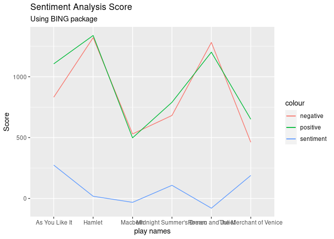<!-- --> ## top
emotional words - NRC

``` r
nrc_plot = function(playname){  
  playname %>% 
  unnest_tokens(word, Text) %>%
  inner_join(get_sentiments("nrc")) %>%
  count(word, sentiment, sort = TRUE) %>%
  group_by(sentiment) %>%
  slice_max(n, n = 10) %>%
  mutate(word = reorder(word, n)) %>%
  ggplot(aes(n, word, fill = sentiment)) +
  geom_col(show.legend = FALSE) +
  facet_wrap(vars(sentiment), scales = "free_y") +
  labs(title = "Number of Occurence of Top Emotional Words",
       x = "Number of Occurence",
       y = NULL)
}
nrc_plot(venice)
```

    ## Joining, by = "word"

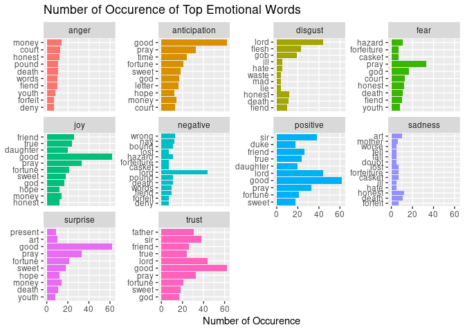<!-- -->

``` r
nrc_plot(romeo)
```

    ## Joining, by = "word"

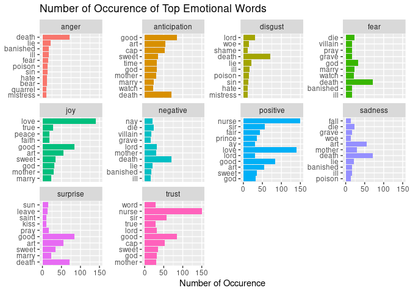<!-- -->

``` r
nrc_plot(macbeth)
```

    ## Joining, by = "word"

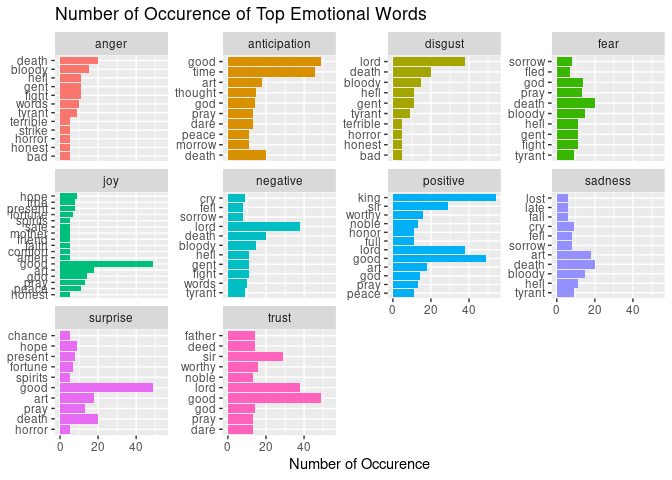<!-- -->

``` r
nrc_plot(asyoulikeit)
```

    ## Joining, by = "word"

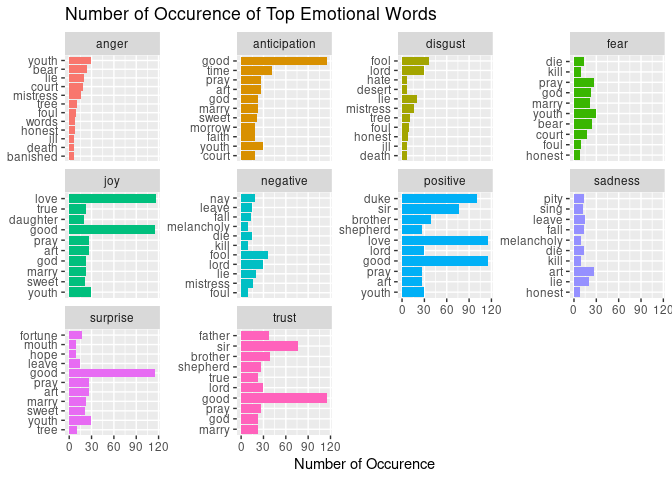<!-- -->

``` r
nrc_plot(hamlet)
```

    ## Joining, by = "word"

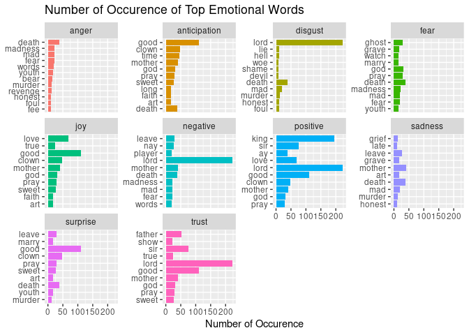<!-- -->

``` r
nrc_plot(midnight)
```

    ## Joining, by = "word"

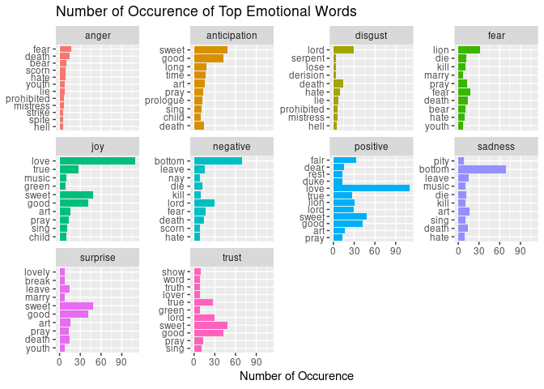<!-- --> ## top
emotional words - Afinn

``` r
afinn_plot = function(playname){  
  playname %>% 
  unnest_tokens(word, Text) %>%
  inner_join(get_sentiments("afinn")) %>%
  count(word, value, sort = TRUE) %>%
  group_by(value) %>%
  slice_max(n, n = 10) %>%
  mutate(word = reorder(word, n)) %>%
  ggplot(aes(n, word, fill = value)) +
  geom_col(show.legend = FALSE) +
  facet_wrap(vars(value), scales = "free_y") +
  labs(title = "Top Emotional Words Grouped by AFinn package",
       x = "Number of Occurence",
       y = NULL)
} 
afinn_plot(venice)
```

    ## Joining, by = "word"

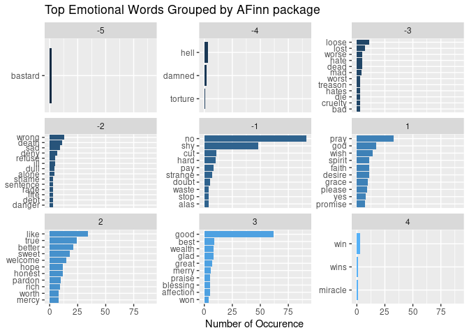<!-- -->

``` r
afinn_plot(romeo)
```

    ## Joining, by = "word"

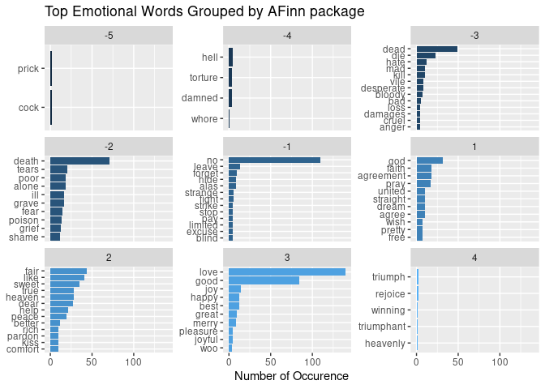<!-- -->

``` r
afinn_plot(macbeth)
```

    ## Joining, by = "word"

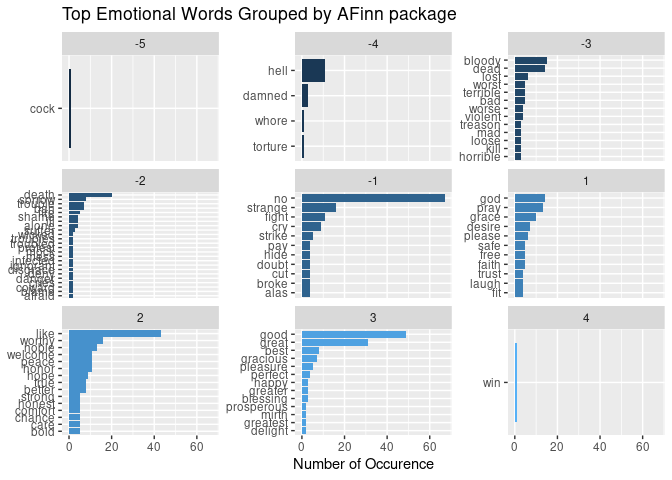<!-- -->

``` r
afinn_plot(asyoulikeit)
```

    ## Joining, by = "word"

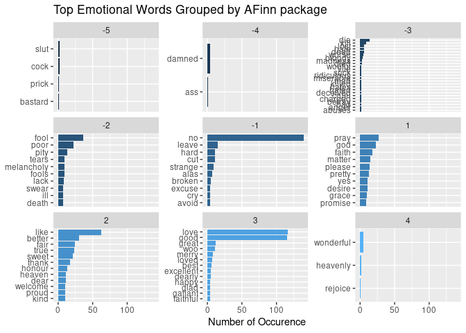<!-- -->

``` r
afinn_plot(hamlet)
```

    ## Joining, by = "word"

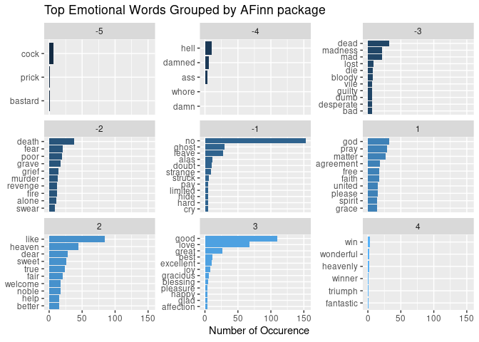<!-- -->

``` r
afinn_plot(midnight)
```

    ## Joining, by = "word"

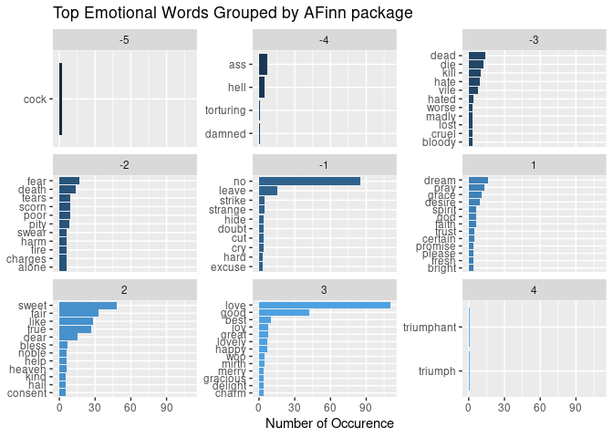<!-- -->
